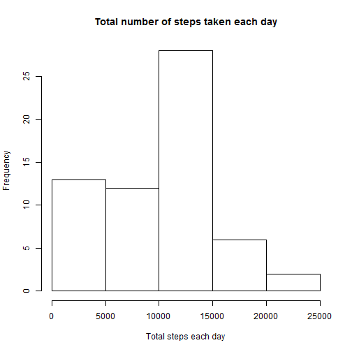
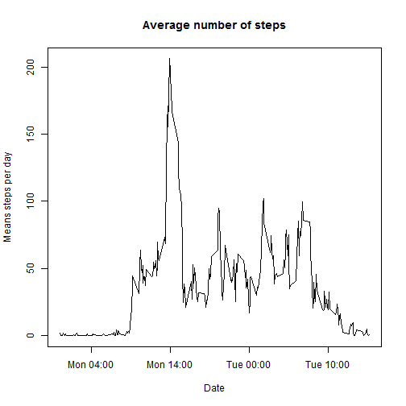
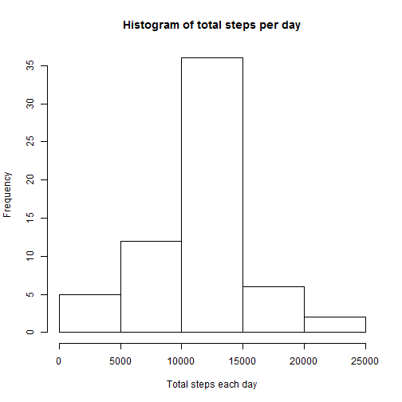

Peer assessment one
=====================================================================================
This file is written for peer assignment one, which is focused on  processing the raw data of personal movement collected by activity monitoring devices

### Loading and preprocessing the data


```r
library(dplyr)

## Read the data in
if (file.exists("activity.csv")){
    data <- read.csv("activity.csv", colClasses = "character")
}

## Use tbl_df
df <- tbl_df(data)

## Change the class of variables
df$date <- as.Date(df$date, "%Y-%m-%d")
df$steps <- as.numeric(df$steps)
df$interval <- as.numeric(df$interval)
```

### What is mean total number of steps taken per day?

```r
days <- group_by(df, date)
total_step <- summarise(days,  steps = sum(steps, na.rm = TRUE))
hist(total_step$steps, xlab = "Total steps each day", main = "Total number of steps taken each day")
```

 

```r
mean_step <- mean(total_step$steps)
median_step <- median(total_step$steps)
cat("The mean of the total number of steps taken per day is :", mean_step)
```

```
## The mean of the total number of steps taken per day is : 9354.23
```

```r
cat("The median of the total number of steps taken per day is :", median_step)
```

```
## The median of the total number of steps taken per day is : 10395
```

### What is the average daily activity pattern?

```r
library(lubridate)

interval_ave <-  df %>% group_by(interval) %>% summarise(mean_steps = mean(steps, na.rm = TRUE))
dur <- new_duration(interval_ave$interval)
dur <- dminutes(dur)
## Find the start date
start <- min(df$date)
## Change the time interval into date
interval_ave$time <- ymd(as.character(start)) + dur
## Do the plot using the time moment instead of interval
plot(interval_ave$time, interval_ave$mean_steps, type = 'l', xlab = "Date", ylab = "Means steps per day", main = "Average number of steps")
```

 

```r
interval_sum <-  df %>% group_by(interval) %>% summarise(total_steps = sum(steps, na.rm = TRUE))
max_interval <- filter(interval_sum, total_steps == max(total_steps))
max_moment <- ymd(as.character(start)) + dminutes(new_duration(max_interval$interval))
cat("The interval which contains the maximum number of steps is :", as.character(max_moment))
```

```
## The interval which contains the maximum number of steps is : 2012-10-01 13:55:00
```

### Imputing missing values

```r
na_num <- sum(is.na(df$steps))
cat("The total number of missing values is :", na_num)
```

```
## The total number of missing values is : 2304
```

```r
## Fill the missing values with mean value for that 5-minute interval
tdf <- df
for (i in c(1:nrow(df))){
    if(is.na(df[i,]$steps)){
        na_interval = df[i,]$interval
        sub_ave = filter(interval_ave, interval == na_interval)
        tdf[i,]$steps = sub_ave$mean_steps[1]
    }
}

new_days <- group_by(tdf, date)
new_total_step <- summarise(new_days,  steps = sum(steps, na.rm = TRUE))
hist(new_total_step$steps, xlab = "Total steps each day", main = "Histogram of total steps per day")
```

 

```r
new_mean_step <- mean(new_total_step$steps)
new_median_step <- median(new_total_step$steps)
```

### Are there differences in activity patterns between weekdays and weekends?

```r
library(ggplot2)
## Set the system locale
Sys.setlocale("LC_TIME", "US")
```

```
## [1] "English_United States.1252"
```

```r
tdf <- mutate(tdf, is_weekend = as.numeric(weekdays(date) %in% c("Saturday", "Sunday")))

## Add the variable which indicates either weekday or weekend
interval_ave_week <-  tdf %>% group_by(interval, is_weekend) %>% summarise(mean_steps = mean(steps, na.rm = TRUE))
interval_ave_week$is_weekend[interval_ave_week$is_weekend == 0] = "Weekday"
interval_ave_week$is_weekend[interval_ave_week$is_weekend == 1] = "Weekend"

dur <- new_duration(interval_ave_week$interval)
dur <- dminutes(dur)
start <- min(tdf$date)
interval_ave_week$time <- ymd(as.character(start)) + dur
g <- ggplot(interval_ave_week, aes(time, mean_steps))
g + geom_line(size = 1) + facet_wrap(~is_weekend,ncol=1) + 
    labs(y = 'Number of steps', x = 'Interval', title = 'The average number of steps taken(Weekdays/Weekends)')
```

 
